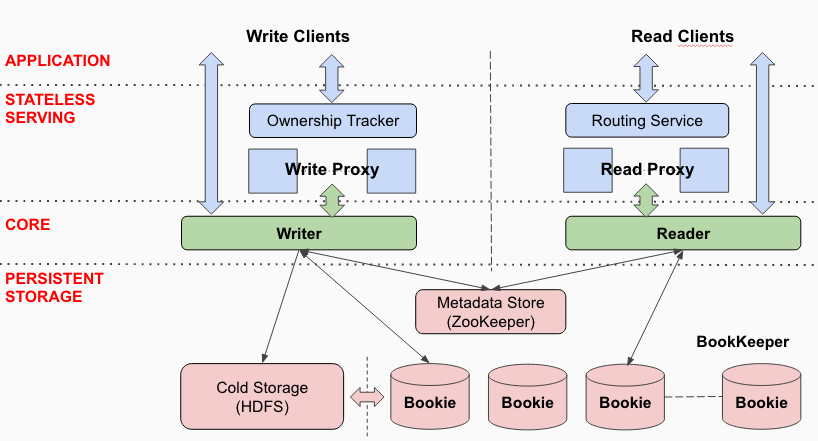

<!DOCTYPE html>
<html lang="en">

  <head>
  <meta charset="utf-8">
  <meta http-equiv="X-UA-Compatible" content="IE=edge">
  <meta name="viewport" content="width=device-width, initial-scale=1">

  <title>Apache DistributedLog</title>
  <meta name="description" content="Apache DistributedLog is an high performance replicated log.
">

  <link rel="stylesheet" href="/distributedlog-staging-site/styles/site.css">
  <link rel="stylesheet" href="/distributedlog-staging-site/css/theme.css">
  
  
  <link rel="canonical" href="http://bookkeeper.apache.org/distributedlog/distributedlog-staging-site/docs/0.4.0-incubating/user_guide/architecture/main.rst" data-proofer-ignore>
  <link rel="alternate" type="application/rss+xml" title="Apache DistributedLog" href="http://bookkeeper.apache.org/distributedlog/distributedlog-staging-site/feed.xml">
   
  <link rel="shortcut icon" type="image/x-icon" href="/images/favicon.ico">
</head>

  <body role="document">

    <nav class="navbar navbar-default navbar-fixed-top">
  

    

      
      <button type="button" class="navbar-toggle collapsed" data-toggle="collapse" data-target="#navbar" aria-expanded="false" aria-controls="navbar">
        Toggle navigation
        
        
        
      </button>
    

    

      <ul class="nav navbar-nav">
        <!-- Overview -->
        <li><a href="/distributedlog-staging-site/docs/latest/basics/introduction">Overview</a></li>
        <!-- Downloads -->
        <li><a href="/distributedlog-staging-site/docs/latest/start/download">Downloads</a></li>
        <!-- Quick Start -->
        <li class="dropdown">
          <a href="#" class="dropdown-toggle" data-toggle="dropdown" role="button" aria-haspopup="true" aria-expanded="false">Quick Start</a>
          <ul class="dropdown-menu">
            <li><a href="/distributedlog-staging-site/docs/latest/start/quickstart">Setup & Run Example</a></li>
            <li role="separator" class="divider"></li>
            <li class="dropdown-header">Tutorials</li>
            <li>
              <a href="/distributedlog-staging-site/docs/latest/tutorials/main#id3">
              <small></small>
              Basic
              </a>
            </li>
            <li>
              <a href="/distributedlog-staging-site/docs/latest/tutorials/main#id4">
              <small></small>
              Messaging
              </a>
            </li>
            <li>
              <a href="/distributedlog-staging-site/docs/latest/tutorials/main#id6">
              <small></small>
              Analytics
              </a>
            </li>
          </ul>
        </li>
        <!-- Documentation -->
        <li class="dropdown">
		      <a href="#" class="dropdown-toggle" data-toggle="dropdown" role="button" aria-haspopup="true" aria-expanded="false">Documentation</a>
          <ul class="dropdown-menu">
            <li class="dropdown-header">Snapshot (Developement)</li>
            <li><a href="/distributedlog-staging-site/docs/latest">0.5.0-SNAPSHOT</a></li>
            <li role="separator" class="divider"></li>
            <li class="dropdown-header">Releases</li>
            <li><a href="/distributedlog-staging-site/docs/0.4.0-incubating">0.4.0-incubating</a></li>
            <li role="separator" class="divider"></li>
            <li>
              <a href="https://cwiki.apache.org/confluence/display/DL/Project+Ideas">
                <small></small>
                Project Ideas
              </a>
            </li>
          </ul>
        </li>
        <!-- FAQ -->
        <li><a href="/distributedlog-staging-site/faq">FAQ</a></li>
      </ul>
      <!-- Right Side -->
      <ul class="nav navbar-nav navbar-right">
        <!-- Blog -->
        <li><a href="/distributedlog-staging-site/blog">Blog</a></li>
        <!-- Community -->
        <li class="dropdown">
          <a href="#" class="dropdown-toggle" data-toggle="dropdown" role="button" aria-haspopup="true" aria-expanded="false">Community</a>
          <ul class="dropdown-menu">
            <li class="dropdown-header">Community</li>
            <li><a href="/distributedlog-staging-site/community/#mailing-lists">Mailing Lists</a></li>
            <li><a href="/distributedlog-staging-site/community/#source-code">Source Code</a></li>
            <li><a href="/distributedlog-staging-site/community/#issue-tracker">Issue Tracking</a></li>
            <li><a href="/distributedlog-staging-site/community/team/">Team</a></li>
            <li role="separator" class="divider"></li>
            <li class="dropdown-header">Contribute</li>
            <li><a href="https://cwiki.apache.org/confluence/display/DL/Developer+Setup">Developer Setup</a></li>
            <li><a href="https://cwiki.apache.org/confluence/display/DL/Contributing+to+DistributedLog">Contributing to DistributedLog</a></li>
            <li><a href="https://cwiki.apache.org/confluence/pages/viewpage.action?pageId=65867477">Coding Guide</a></li>
            <li role="separator" class="divider"></li>
            <li class="dropdown-header">Guides</li>
            <li><a href="/distributedlog-staging-site/community/release-guide">Release Guide</a></li>
          </ul>
        </li>
        <!-- Project -->
        <li class="dropdown">
          <a href="#" class="dropdown-toggle" data-toggle="dropdown" role="button" aria-haspopup="true" aria-expanded="false">Project</a>
          <ul class="dropdown-menu">
			      <li class="dropdown-header">Project</li>
            <li><a href="/distributedlog-staging-site/project/presentations/">Presentations</a></li>
            <li>
              <a href="https://twitter.com/distributedlog">
                <small></small>
                Twitter
              </a>
            </li>
            <li>
              <a href="https://github.com/apache/distributedlog">
                <small></small>
                Github
              </a>
            </li>
            <li>
              <a href="https://getdl-slack.herokuapp.com">
                <small></small>
                Slack
              </a>
            </li>
            <li>
              <a href="https://cwiki.apache.org/confluence/display/DL/Apache+DistributedLog+Home">
                <small></small>
                Wiki
              </a>
            </li>
          </ul>
        </li>
      </ul>
    
<!--/.nav-collapse -->
  

</nav>

<link rel="stylesheet" href="">

    

      

        .. contents:: Architecture

Architecture
============

Data Model
----------

DistributedLog exposes the `log stream` as the unit of operations. A `log stream` is a totally ordered,
immutable sequence of log records. A `log record` is a sequence of bytes. Log records are batched into `entries`
and written into `log segments`. Figure 1 illustrates the logical elements of a log stream.

.. figure:: ../../images/datamodel.png
   :align: center

   Figure 1. Anatomy of a log stream

Log Segments
~~~~~~~~~~~~

Although the application views the log stream as a continuous sequence of log records, it is physically stored as
multiple `log segments`, where these segments are the unit of `manageability`. All the records in a log segment have
the same replication configuration. The log segments are allocated, distributed and stored in a `log segment store`.
As records are written to the log stream, DistributedLog switches to a new log segment based on a configured `rolling policy`.
The rolling policy can be `time-based` i.e. based on a configured period of time (e.g. every 2 hours) or `size-based`
i.e. based on a maximum log segment size (e.g. every 128MB). This allows the log segments to be distributed evenly
across all the storage nodes. This helps evenly spread read traffic to avoid hot spots in the cluster.

A log segment is also the unit of data retention. Log segments are deleted either by explicitly truncation or expiration.
Old data is garbage collected by the log segment store once the log segments are deleted.

Log Sequence Numbers
~~~~~~~~~~~~~~~~~~~~

`Log records` are written sequentially into a log stream, and assigned a unique sequence number called `DLSN`
(DistributedLog Sequence Number). A DLSN is comprised of 3 components: a `Log Segment Sequence Number` (LSSN),
the sequence number of the log segment that the record belongs to, an `Entry ID` (EID) - the entry id in this log segment
that the record is in, and a `Slot ID` (SID) - the slot within the entry. Records can be ordered by DLSN. 

Besides DLSN, an application can assign a `Transaction ID`,  a non-decreasing positive 64-bit integer, to each log record it writes.
This facilitates application-specific sequencing of records and positioning of the reader. For example, a common use of the transaction ID
is to store the timestamp of when the log record was added to the log stream. This transaction ID can then be used to rewind to a specific
time in analytics applications.

Namespace
~~~~~~~~~

Log streams that belong to same application are usually categorized and managed under a `namespace`. A `namespace` is used by applications
to locate where the log streams are. Applications can `create` and `delete` streams under a namespace, and `truncate` a stream to given ID.

Software Stack
--------------

The software stack is shown in Figure 2. The software stack is divided into three layers, with each layer is responsible for
different features of DistributedLog. These layers are `Persistent Storage`, `DistributedLog Core` and `Stateless Serving`.

   Figure 2. DistributedLog Software Stack

Persistent Storage
~~~~~~~~~~~~~~~~~~

DistributedLog provides the core features - `durability`, `availability` and `consistency` through the storage layer.
The main components in storage layer are `Log Segment Store`, `Cold Storage` and `Metadata Store`.

Log Segment Store
+++++++++++++++++

The Log segment store is responsible for storing the log segments as they are created and ensure they are durably replicated.
We use `Apache BookKeeper` as the log segment store. BookKeeper helps us achieve low tail latencies for writes and reads as well as
low delivery latency which is the end to end latency from when the record is generated until it is read by the reader - because bookkeeper's
storage layout is optimized for I/O isolation for log workloads.

In addition to storage layout optimization, the log segment store (via BookKeeper) also provides a built-in `fencing` mechanism for
achieving strong consistency among multiple writers. We will discuss more about consistency in section `Design Details`.

Cold Storage
++++++++++++

The data in the log segment store is eventually moved to a `cold storage`. Cold storage allows cost efficient storage of large volumes
of log segments for extended period of time. Applications many want to have access to old data for application error recovery or debugging.
As log segments are completed, they are proactively copied over to the cold storage, thereby providing a backup for disaster recovery or an
operation error. We use HDFS as our cold storage.

Metadata Store
++++++++++++++

The metadata in DistributedLog consists of the mapping from log streams to their constituent log segments as well as each log segment's metadata.
The log segment metadata includes the `log segment ID`, `start and end transaction IDs`, `completion time`, and its `status`. The metadata store
is required to provide metadata operations such as consistent read and write ordering to guarantee metadata consistency in the event of failures.
Also the metadata store should provide a notification mechanism to support streaming reads. We use ZooKeeper as the metadata store, because it is
a strongly consistent data store which provides versioned updates, strong ordering and notifications using watches.

DistributedLog Core
~~~~~~~~~~~~~~~~~~~

DistributedLog builds its core functionality on top of the log segment store and the metadata store. It provides the core data model of log streams
and its naming system, and provides a `single-writer-multiple-reader` access model.

Writers write data into the logs of their choice. Writers sequence log records written to the log streams. Therefore there is only one active log
segment for a given log stream at a time. Correctness and consistency are guaranteed using a fencing mechanism in the log segment store and
versioned metadata updates to prevent two writers from writing to the same log stream after a network partition.

Reading from a log stream starts by `positioning` a reader on a log record by specifying either a DLSN or a Transaction Id. Once a reader has been
positioned, it receives all the log records in increasing order of the sequence numbers and each record is delivered exactly once. It is up to
individual applications to choose an appropriate mechanism to record readers positions and provide this position when a new reader session begins
(e.g restart from a failure). Applications can choose the appropriate method for storing positions based on the desired processing semantics.

Stateless Serving
~~~~~~~~~~~~~~~~~

A stateless serving layer is built on top of the storage layer to support large number of writers and readers. The serving layer includes `Write Proxy`
and `Read Proxy`. `Write Proxy` manages the ownerships of the log streams, forwards the write requests to storage via the core library and handles
load balancing and failover. It allows sequencing writes from many clients (aka `Fan-in`). `Read Proxy` caches log records for multiple readers consuming
the same log stream.

Ownership Tracker
+++++++++++++++++

`Ownership Tracker` tracks the liveness of the owners of the log streams and fails over the ownership to other healthy write proxies when the current
owner becomes unavailable. Since we already use zookeeper for metadata storage, we also use zookeeper for tracking the liveness of write proxies using
`ephemeral znodes` and failover the ownership when zookeeper session expires.

Routing Service
+++++++++++++++
Since readers read committed data and are strict followers, the read proxies do not have to track ownership of log streams. We use consistent hashing
as a routing mechanism to route the readers to corresponding read proxies.

Applications can either use a thin client that talks to the serving tier to access DistributedLog or embed the core library to talk to the storage directly
when they require strict write ordering. Applications choose partitioning strategies and track their reader positions based on their specific requirements.

Lifecyle of records
-------------------

Figure 3 illustrates the lifecycle of a log record in DistributedLog as it flows from writers to readers and we discuss how different layers interact with
each other.

   Figure 3. Lifecycle of a record 

The application constructs the log records and initiates write requests (step 1). The write requests will be forwarded to the write proxy that is the master
of the log stream. The master writer proxy will write the records in the log stream's transmit buffer. Based on the configured transmit policy, records in
the transmit buffer will be transmitted as a batched entry to log segment store (step 2). Application can trade latency for throughput by transmitting
`immediately` (lowest latency), `periodically` (grouping records that appear within the transmit period) or when transmit buffer has accumulated more than
`max-outstanding bytes`.

The batched entry is transmitted to multiple bookies (storage nodes in bookkeeper cluster) in parallel (step 3). The log segment store will respond back to
writer once the entry is persisted durably on disk. Once the write proxy receives confirmation of durability from a quorum of bookies, it will send an
acknowledgement to the application (step 4).

Although the writer knows that the record is guaranteed to be persisted and replicated in bookkeeper. Individual bookies do not necessarily know that the
consensus agreement has been reached for this record. The writer must therefore record a `commit` to make this record visible to all the readers.
This `commit` can piggyback on the next batch of records from the application. If no new application records are received within the specified SLA for
persistence, the writer will issue a special `control log record` notifying the log segment store that the record can now be made visible to readers (step 5).

The readers' request that is waiting for new data using `long polling` will now receive the recent committed log records (step 6). Speculative long poll reads will be sent to other replicas to archieve predictable low 99.9% percentile latency (step 7).

The log records will be cached in read proxies (step 8) for fanout readers. The read clients also use similar long poll read mechanism to read data from read proxies (step 9).

      

    

  

      

          <footer>
              
&copy; Copyright 2016
                  <a href="http://www.apache.org">The Apache Software Foundation.</a> All Rights Reserved.
              

              

                  <a href="/distributedlog-staging-site/feed.xml">RSS Feed</a>
              

          </footer>
      

  

  <!-- container div end -->

  </body>

</html>
