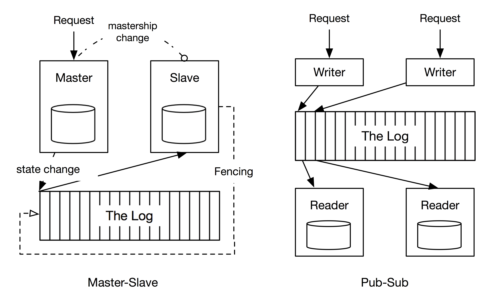

<!DOCTYPE html>
<html lang="en">

  <head>
  <meta charset="utf-8">
  <meta http-equiv="X-UA-Compatible" content="IE=edge">
  <meta name="viewport" content="width=device-width, initial-scale=1">

  <title>Apache DistributedLog</title>
  <meta name="description" content="Apache DistributedLog is an high performance replicated log.
">

  <link rel="stylesheet" href="/distributedlog-staging-site/styles/site.css">
  <link rel="stylesheet" href="/distributedlog-staging-site/css/theme.css">
  
  
  <link rel="canonical" href="http://bookkeeper.apache.org/distributedlog/distributedlog-staging-site/docs/0.4.0-incubating/user_guide/considerations/main.rst" data-proofer-ignore>
  <link rel="alternate" type="application/rss+xml" title="Apache DistributedLog" href="http://bookkeeper.apache.org/distributedlog/distributedlog-staging-site/feed.xml">
   
  <link rel="shortcut icon" type="image/x-icon" href="/images/favicon.ico">
</head>

  <body role="document">

    <nav class="navbar navbar-default navbar-fixed-top">
  

    

      
      <button type="button" class="navbar-toggle collapsed" data-toggle="collapse" data-target="#navbar" aria-expanded="false" aria-controls="navbar">
        Toggle navigation
        
        
        
      </button>
    

    

      <ul class="nav navbar-nav">
        <!-- Overview -->
        <li><a href="/distributedlog-staging-site/docs/latest/basics/introduction">Overview</a></li>
        <!-- Downloads -->
        <li><a href="/distributedlog-staging-site/docs/latest/start/download">Downloads</a></li>
        <!-- Quick Start -->
        <li class="dropdown">
          <a href="#" class="dropdown-toggle" data-toggle="dropdown" role="button" aria-haspopup="true" aria-expanded="false">Quick Start</a>
          <ul class="dropdown-menu">
            <li><a href="/distributedlog-staging-site/docs/latest/start/quickstart">Setup & Run Example</a></li>
            <li role="separator" class="divider"></li>
            <li class="dropdown-header">Tutorials</li>
            <li>
              <a href="/distributedlog-staging-site/docs/latest/tutorials/main#id3">
              <small></small>
              Basic
              </a>
            </li>
            <li>
              <a href="/distributedlog-staging-site/docs/latest/tutorials/main#id4">
              <small></small>
              Messaging
              </a>
            </li>
            <li>
              <a href="/distributedlog-staging-site/docs/latest/tutorials/main#id6">
              <small></small>
              Analytics
              </a>
            </li>
          </ul>
        </li>
        <!-- Documentation -->
        <li class="dropdown">
		      <a href="#" class="dropdown-toggle" data-toggle="dropdown" role="button" aria-haspopup="true" aria-expanded="false">Documentation</a>
          <ul class="dropdown-menu">
            <li class="dropdown-header">Snapshot (Developement)</li>
            <li><a href="/distributedlog-staging-site/docs/latest">0.5.0-SNAPSHOT</a></li>
            <li role="separator" class="divider"></li>
            <li class="dropdown-header">Releases</li>
            <li><a href="/distributedlog-staging-site/docs/0.4.0-incubating">0.4.0-incubating</a></li>
            <li role="separator" class="divider"></li>
            <li>
              <a href="https://cwiki.apache.org/confluence/display/DL/Project+Ideas">
                <small></small>
                Project Ideas
              </a>
            </li>
          </ul>
        </li>
        <!-- FAQ -->
        <li><a href="/distributedlog-staging-site/faq">FAQ</a></li>
      </ul>
      <!-- Right Side -->
      <ul class="nav navbar-nav navbar-right">
        <!-- Blog -->
        <li><a href="/distributedlog-staging-site/blog">Blog</a></li>
        <!-- Community -->
        <li class="dropdown">
          <a href="#" class="dropdown-toggle" data-toggle="dropdown" role="button" aria-haspopup="true" aria-expanded="false">Community</a>
          <ul class="dropdown-menu">
            <li class="dropdown-header">Community</li>
            <li><a href="/distributedlog-staging-site/community/#mailing-lists">Mailing Lists</a></li>
            <li><a href="/distributedlog-staging-site/community/#source-code">Source Code</a></li>
            <li><a href="/distributedlog-staging-site/community/#issue-tracker">Issue Tracking</a></li>
            <li><a href="/distributedlog-staging-site/community/team/">Team</a></li>
            <li role="separator" class="divider"></li>
            <li class="dropdown-header">Contribute</li>
            <li><a href="https://cwiki.apache.org/confluence/display/DL/Developer+Setup">Developer Setup</a></li>
            <li><a href="https://cwiki.apache.org/confluence/display/DL/Contributing+to+DistributedLog">Contributing to DistributedLog</a></li>
            <li><a href="https://cwiki.apache.org/confluence/pages/viewpage.action?pageId=65867477">Coding Guide</a></li>
            <li role="separator" class="divider"></li>
            <li class="dropdown-header">Guides</li>
            <li><a href="/distributedlog-staging-site/community/release-guide">Release Guide</a></li>
          </ul>
        </li>
        <!-- Project -->
        <li class="dropdown">
          <a href="#" class="dropdown-toggle" data-toggle="dropdown" role="button" aria-haspopup="true" aria-expanded="false">Project</a>
          <ul class="dropdown-menu">
			      <li class="dropdown-header">Project</li>
            <li><a href="/distributedlog-staging-site/project/presentations/">Presentations</a></li>
            <li>
              <a href="https://twitter.com/distributedlog">
                <small></small>
                Twitter
              </a>
            </li>
            <li>
              <a href="https://github.com/apache/distributedlog">
                <small></small>
                Github
              </a>
            </li>
            <li>
              <a href="https://getdl-slack.herokuapp.com">
                <small></small>
                Slack
              </a>
            </li>
            <li>
              <a href="https://cwiki.apache.org/confluence/display/DL/Apache+DistributedLog+Home">
                <small></small>
                Wiki
              </a>
            </li>
          </ul>
        </li>
      </ul>
    
<!--/.nav-collapse -->
  

</nav>

<link rel="stylesheet" href="">

    

      

        Considerations
==============

As different applications have different requirements, we've carefully considered the capabilities
that should be included in DistributedLog leaving the rest up to the applications. These considerations are: 

Consistency, Durability and Ordering
~~~~~~~~~~~~~~~~~~~~~~~~~~~~~~~~~~~~

The distributed systems literature commonly refers to two broad paradigms to use a log
for building reliable replicated systems (Figure 1). The `Pub-Sub` paradigm usually
refers to an active-active model where we keep a log of the incoming requests and each
replica(reader) processes each request. While the `Master-Slave` paradigm elects one
replica as the master to process requests as they arrive and log changes to its state.
The other replicas referred to as slaves apply the state changes in the same order as
the master, thereby being in sync and ready to take over the mastership if the current
master fails. If the current master loses connectivity to the slaves due to a network
partition, the slaves may elect a new master to continue forward progress. A fencing
mechanism is necessary for the old master to discover that it has lost ownership and
prevent it from modifying state after network connectivity is restored.

   Figure 1. The uses of a log in distributed systems

These two different approaches indicate two different types of ordering requirements -
`Write Ordering` and `Read Ordering`. `Write ordering` requires that all writes issued
by the log writer be written in a strict order to the log, while `read ordering` only
requires that any reader that reads the log stream should see the same record at any
given position, the log records however may not appear in the same order that the writer
wrote them. The replicated log service should be able to support both use cases. 

Partitioning
~~~~~~~~~~~~

`Partitioning` (also known as sharding or bucketing) facilitates horizontal scale. The
partitioning scheme depends on the characteristics of the application and is closely
related to the ordering guarantees that the application requires. For example, distributed
key/value store that uses DistributedLog as its transaction log, distributes the data into
partitions each of which is a unit of consistency. Modifications within each partition are
required to be strictly ordered. On the other hand, real-time analytics workloads don't
require strict order, can use *round-robin* partitioning to evenly distribute the reads and
writes across all partitions. It is therefore prudent to provide applications the flexibility
to choose a suitable partitioning scheme.

Processing Semantics
~~~~~~~~~~~~~~~~~~~~

Applications typically choose between `at-least-once` and `exactly-once` processing semantics.
`At-least-once` processing guarantees that the application will process all the log records,
however when the application resumes after failure, previously processed records may be
re-processed if they have not been acknowledged. `Exactly once` processing is a stricter
guarantee where applications must see the effect of processing each record exactly once.
`Exactly once` semantics can be achieved by maintaining reader positions together with the
application state and atomically updating both the reader position and the effects of the
corresponding log records. For instance, for strongly consistent updates in a distributed
key/value store the reader position must be persisted atomically with the changes applied
from the corresponding log records. Upon restart from a failure, the reader resumes from the
last persisted position thereby guaranteeing that each change is applied only once. With at
least once processing guarantees the application can store reader positions in an external
store and update it periodically. Upon restart the application will reprocess messages since
the last updated reader position.

      

    

  

      

          <footer>
              
&copy; Copyright 2016
                  <a href="http://www.apache.org">The Apache Software Foundation.</a> All Rights Reserved.
              

              

                  <a href="/distributedlog-staging-site/feed.xml">RSS Feed</a>
              

          </footer>
      

  

  <!-- container div end -->

  </body>

</html>
