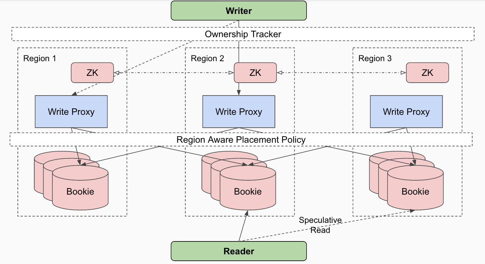

<!DOCTYPE html>
<html lang="en">

  <head>
  <meta charset="utf-8">
  <meta http-equiv="X-UA-Compatible" content="IE=edge">
  <meta name="viewport" content="width=device-width, initial-scale=1">

  <title>Apache DistributedLog</title>
  <meta name="description" content="Apache DistributedLog is an high performance replicated log.
">

  <link rel="stylesheet" href="/distributedlog-staging-site/styles/site.css">
  <link rel="stylesheet" href="/distributedlog-staging-site/css/theme.css">
  
  
  <link rel="canonical" href="http://bookkeeper.apache.org/distributedlog/distributedlog-staging-site/docs/latest/user_guide/globalreplicatedlog/main.rst" data-proofer-ignore>
  <link rel="alternate" type="application/rss+xml" title="Apache DistributedLog" href="http://bookkeeper.apache.org/distributedlog/distributedlog-staging-site/feed.xml">
   
  <link rel="shortcut icon" type="image/x-icon" href="/images/favicon.ico">
</head>

  <body role="document">

    <nav class="navbar navbar-default navbar-fixed-top">
  

    

      
      <button type="button" class="navbar-toggle collapsed" data-toggle="collapse" data-target="#navbar" aria-expanded="false" aria-controls="navbar">
        Toggle navigation
        
        
        
      </button>
    

    

      <ul class="nav navbar-nav">
        <!-- Overview -->
        <li><a href="/distributedlog-staging-site/docs/latest/basics/introduction">Overview</a></li>
        <!-- Downloads -->
        <li><a href="/distributedlog-staging-site/docs/latest/start/download">Downloads</a></li>
        <!-- Quick Start -->
        <li class="dropdown">
          <a href="#" class="dropdown-toggle" data-toggle="dropdown" role="button" aria-haspopup="true" aria-expanded="false">Quick Start</a>
          <ul class="dropdown-menu">
            <li><a href="/distributedlog-staging-site/docs/latest/start/quickstart">Setup & Run Example</a></li>
            <li role="separator" class="divider"></li>
            <li class="dropdown-header">Tutorials</li>
            <li>
              <a href="/distributedlog-staging-site/docs/latest/tutorials/main#id3">
              <small></small>
              Basic
              </a>
            </li>
            <li>
              <a href="/distributedlog-staging-site/docs/latest/tutorials/main#id4">
              <small></small>
              Messaging
              </a>
            </li>
            <li>
              <a href="/distributedlog-staging-site/docs/latest/tutorials/main#id6">
              <small></small>
              Analytics
              </a>
            </li>
          </ul>
        </li>
        <!-- Documentation -->
        <li class="dropdown">
		      <a href="#" class="dropdown-toggle" data-toggle="dropdown" role="button" aria-haspopup="true" aria-expanded="false">Documentation</a>
          <ul class="dropdown-menu">
            <li class="dropdown-header">Snapshot (Developement)</li>
            <li><a href="/distributedlog-staging-site/docs/latest">0.5.0-SNAPSHOT</a></li>
            <li role="separator" class="divider"></li>
            <li class="dropdown-header">Releases</li>
            <li><a href="/distributedlog-staging-site/docs/0.4.0-incubating">0.4.0-incubating</a></li>
            <li role="separator" class="divider"></li>
            <li>
              <a href="https://cwiki.apache.org/confluence/display/DL/Project+Ideas">
                <small></small>
                Project Ideas
              </a>
            </li>
          </ul>
        </li>
        <!-- FAQ -->
        <li><a href="/distributedlog-staging-site/faq">FAQ</a></li>
      </ul>
      <!-- Right Side -->
      <ul class="nav navbar-nav navbar-right">
        <!-- Blog -->
        <li><a href="/distributedlog-staging-site/blog">Blog</a></li>
        <!-- Community -->
        <li class="dropdown">
          <a href="#" class="dropdown-toggle" data-toggle="dropdown" role="button" aria-haspopup="true" aria-expanded="false">Community</a>
          <ul class="dropdown-menu">
            <li class="dropdown-header">Community</li>
            <li><a href="/distributedlog-staging-site/community/#mailing-lists">Mailing Lists</a></li>
            <li><a href="/distributedlog-staging-site/community/#source-code">Source Code</a></li>
            <li><a href="/distributedlog-staging-site/community/#issue-tracker">Issue Tracking</a></li>
            <li><a href="/distributedlog-staging-site/community/team/">Team</a></li>
            <li role="separator" class="divider"></li>
            <li class="dropdown-header">Contribute</li>
            <li><a href="https://cwiki.apache.org/confluence/display/DL/Developer+Setup">Developer Setup</a></li>
            <li><a href="https://cwiki.apache.org/confluence/display/DL/Contributing+to+DistributedLog">Contributing to DistributedLog</a></li>
            <li><a href="https://cwiki.apache.org/confluence/pages/viewpage.action?pageId=65867477">Coding Guide</a></li>
            <li role="separator" class="divider"></li>
            <li class="dropdown-header">Guides</li>
            <li><a href="/distributedlog-staging-site/community/release-guide">Release Guide</a></li>
          </ul>
        </li>
        <!-- Project -->
        <li class="dropdown">
          <a href="#" class="dropdown-toggle" data-toggle="dropdown" role="button" aria-haspopup="true" aria-expanded="false">Project</a>
          <ul class="dropdown-menu">
			      <li class="dropdown-header">Project</li>
            <li><a href="/distributedlog-staging-site/project/presentations/">Presentations</a></li>
            <li>
              <a href="https://twitter.com/distributedlog">
                <small></small>
                Twitter
              </a>
            </li>
            <li>
              <a href="https://github.com/apache/distributedlog">
                <small></small>
                Github
              </a>
            </li>
            <li>
              <a href="https://getdl-slack.herokuapp.com">
                <small></small>
                Slack
              </a>
            </li>
            <li>
              <a href="https://cwiki.apache.org/confluence/display/DL/Apache+DistributedLog+Home">
                <small></small>
                Wiki
              </a>
            </li>
          </ul>
        </li>
      </ul>
    
<!--/.nav-collapse -->
  

</nav>

<link rel="stylesheet" href="">

    

      

        .. contents:: Global Replicated Log

Global Replicated Log
=====================

A typical setup for DistributedLog is within a datacenter. But a global setup is required for
providing global replicated logs for distributed key/value store to achieve strong consistency
across multiple datacenters. `Global` here means across datacenters, which is different from
`Local` meaning within a datacenter.

A global setup of DistributedLog is organized as a set of `regions`, where each region is the
rough analog of a local setup. Regions are the unit of administrative deployment. The set of
regions is also the set of locations across which data can be replicated. Regions can be added
to or removed from a running system as new datacenters are brought into service and old ones
are turned off, respectively. Regions are also the unit of physical isolation: there may be one
or more regions in a datacenter if they have isolated power or network supplies.

   Figure 1. Global Replicated Log

Figure 1 illustrates the servers in a `Global Replicated Log` setup. There is no inter datacenter
communication between write proxies or log segment storage nodes. The only component that does
inter datacenters communications within its hosts is the 'Global' metadata store, which is a global
setup of ZooKeeper. Write clients will talk to the write proxies in its local region to bootstrap
the ownership cache and redirect to correct write proxies in other regions through direct TCP
connections. While readers will identify the regions of the log segment storage nodes according to
the `region aware` placement policy, and try reading from local region at most of the time and
speculatively try on remote regions.

Region Aware Data Placement Policy
~~~~~~~~~~~~~~~~~~~~~~~~~~~~~~~~~~

Region aware placement policy uses hierarchical allocation where-in nodes are allocated so that data
is spread uniformly across the available regions and within each region it uses the `rack-aware`
placement policy to spread the data uniformly across the available racks.

Region aware placement policy is governed by a parameter ensures that the ack quorum covers at least
*minRegionsForDurability* distinct regions. This ensures that the system can survive the failure of
`(totalRegions - minRegionsForDurability)` regions without loss of availability. For example if we
have bookie nodes in *5* regions and if the *minRegionsForDurability* is *3* then we can survive the
failure of `(5 - 3) = 2` regions.

The placement algorithm follows the following simple invariant:

::

    There is no combination of nodes that would satisfy the ack quorum with
    less than "minRegionsForDurability" responses.

This invariant ensures that enforcing ack quorum is sufficient to enforce that the entry has been made durable
in *minRegionsForDurability* regions.

The *minRegionsForDurability* requirement enforces constraints on the minimum ack quorum as we want to ensure
that when we run in degraded mode - *i.e. when only a subset of the regions are available* - we would still not
be able to allocate nodes in such a way that the ack quorum would be satisfied by fewer than *minRegionsForDurability*
regions.

For instance consider the following scenario with three regions each containing 20 bookie nodes:

::

    minRegionsForDurability = 2
    ensemble size = write quorum = 15
    ack quorum =  8

Let's say that one of the regions is currently unavailable and we want to still ensure that writes can continue.
The ensemble placement may then have to choose bookies from the two available regions. Given that *15* bookies have
to be allocated, we will have to allocate at least *8* bookies from one of the remaining regions - but with ack quorum
of *8* we run the risk of satisfying ack quorum with bookies from a single region. Therefore we must require that
the ack quorum is greater than *8*.

Cross Region Speculative Reads
~~~~~~~~~~~~~~~~~~~~~~~~~~~~~~

As discussed before, read requests can be satisfied by any replica of the data, however for high availability
speculative requests are sent to multiple copies to ensure that at least one of the requests returns within
the time specified by the *SLA*. The reader consults the data placement policy to get the list of replicas that
can satisfy the request in the order of preference. This order is decided as follows:

* The first node in the list is always the bookie node that is closest to the client - if more than one such nodes exist, one is chosen at random.
* The second node is usually the closest node in a different failure domain. In the case of a two level hierarchy that would be a node in a different rack.
* The third node is chosen from a different region

The delay between successive speculative read requests ensures that the probability of sending the *nth*
speculative read request decays exponentially with *n*. This ensures that the number of requests that go to
farther nodes is still kept at a minimum. However by making sure that we cross failure domains in the first
few speculative requests improves fault-tolerance of the reader. Transient node failures are transparently
handled by the reader by this simple and generalizable speculative read policy. This can be thought of as
the most granular form of failover where each request essentially fails-over to an alternate node if the
primary node it attempted to access is unavailable. In practice we have found this to also better handle
network congestion where routes between specific pairs of nodes may become unavailable without necessarily
making the nodes completely inaccessible.

In addition to static decisions based on the location of the bookie nodes, we can also make dynamic decisions
based on observed latency or failure rates from specific bookies. These statistics are tracked by the bookie
client and are used to influence the order in which speculative read requests are scheduled. This again is
able to capture partial network outages that affect specific routes within the network. 

      

    

  

      

          <footer>
              
&copy; Copyright 2016
                  <a href="http://www.apache.org">The Apache Software Foundation.</a> All Rights Reserved.
              

              

                  <a href="/distributedlog-staging-site/feed.xml">RSS Feed</a>
              

          </footer>
      

  

  <!-- container div end -->

  </body>

</html>
